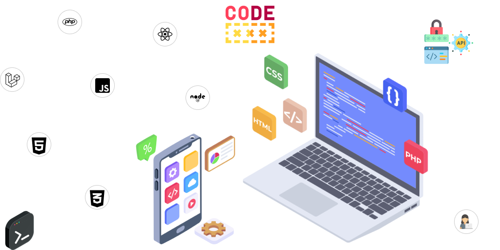

  

 

# Códigos de Teste
- Códigos de teste com elementos pré prontos.

 

  <a href="#rodando"> :arrow_forward: Rodando o Projeto</a>&nbsp;&nbsp;|&nbsp;&nbsp;
  <a href="#contribuir"> :jigsaw: Como Contribuir</a>&nbsp;&nbsp;|&nbsp;&nbsp;
  <a href="#licenca"> :memo: Licença</a>

 

   <h2> :arrow_forward: Rodando o Projeto</h2>

  <h4>
    <b>Observação:</b> Para rodar o(s) projeto(s), acompanhe o passo-a-passo em cada respectivo repositório.
  </h4>

- [Timelines](timelines)

 

    <h2> :jigsaw: Como Contribuir</h2>

1. Faça um fork desse projeto.
2. Crie uma nova branch para trabalhar: `git checkout -b my-feature`
3. Faça commit da sua feature: `git commit -m "feature: My new feature"`
4. Envie as suas alterações: `git push origin my-feature`
5. Solicite uma Pull Request para o diretório original.

 

    <h2> :memo: Licença</h2>

Esse projeto está sob a licença :balance_scale: MIT License. Veja o arquivo [LICENSE](LICENSE) para mais detalhes.

---

Desenvolvido por: :copyright: Thaiza Medeiros :woman_technologist: :purple_heart:
